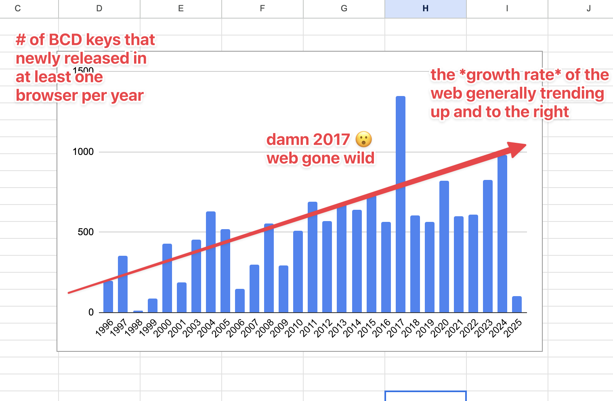

# Web Platform Viz

A quick stab at making [Browser Compat Data (BCD)](https://github.com/mdn/browser-compat-data/) data a little easier to work with for forest-level querying and visualization.

Example grouping BCD keys by year of first release to show the rate of growth of the web platform surface area over almost 30 years, and posted here: https://bsky.app/profile/burrito.space/post/3likfetcvwc2w

## BCD structure / challenges

- BCD is stored in JSON files across a directory structure of varying depth
- the dir names have meaning
- the dirs in the root are a mix of BCD metadata and actual web platform data
- the browser release information is stored separately from the actual compat data, so needs to be mapped back in to do date queries
- each subdirectory may be a broad area, a concrete group, parameter group, or some variation... there's no one easy classification, but anything with a `__compat` field can generally be considered a discrete unit (with sub-units, potentially)
- the format of the json data itself can vary - eg it's valid to have a browser support value that is a string or an array of support entries that have fields that may be strings, booleans or numbers.

## Data flattening

This repo maps the current directory tree structure into unique dot-separated keys with the path info, eg:

`/api/AbortController/abort/reason_parameter/`

becomes:

`api.AbortController.abort.reason_parameter`

The new key is added as the `key` entry in an object containing all the data fields from the `__compat` object for the given key.

The `bcdf.json` file is an array of those objects.

An additional flattening that happens is the `support` object. In BCD each entry in the `support` object can be a string, an object or an array of objects. This script hoist the array values into separate entries, and makes compound keys for all entries by their browser + version.

## Pre-processing

The script also does some preprocessing for convenience.

- `release_date` at the key level: The script adds a `release_date` property to each key, generated by mapping the `version_added` value to data in the `browser` metadata and adding it to the `support` entry, or adding `null` if was never released.
- expanded `mirror` entries into an object which follows above method of getting the release date of the upstream browser

The resulting data structure makes it easy to iterate over the complete list without recursion, and the dot-separated key is a handy human-readable reference which also gives context for where in the tree a key is. Working with a flat list also makes it easier to generate and cache new metadata, and quickly calculate platform-wide stats.

## Usage

Update to latest BCD:

`yarn`

Update `bcdf.json`:

`yarn start`

Which runs `index.js` and generates a new data file and writes to disk as `data/bcdf.json`.
